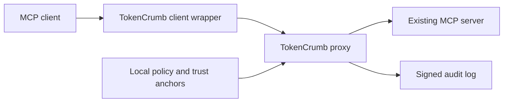

# TokenCrumb - MCP Proxy

A Rust authorization proxy for MCP servers, using attenuable [Biscuit](https://www.biscuitsec.org/) capabilities.

TokenCrumb checks each tool call against a signed capability and a local policy before forwarding it to an existing MCP server. Agents can narrow a capability offline without gaining new permissions. Signed call attestations bind the agent, tool, arguments and token; a signed audit chain records authorization decisions.



## Features

- Tool and resource restrictions, expiry, audience binding and delegation limits.
- Offline attenuation of tools, resources, lifetime, upstream and call budget.
- Agent key binding, argument binding and persistent replay protection.
- Multiple upstreams, with a separate MCP endpoint for each.
- Persistent budgets, signed revocation lists and verifiable audit logs.
- HTTP and stdio upstreams; a stdio client wrapper for desktop MCP clients.
- A CLI for keys, capabilities, policy updates, issuer bootstrap and audit verification.

## Install

Supports Linux and macOS. Requires Rust 1.88 or newer. Build from a checkout:

```sh
cargo install --locked --path crates/tokencrumb-mcp-proxy
tokencrumb --help
```

The executable is `tokencrumb`; the Rust package is `tokencrumb-mcp-proxy`.

**Temporary custom dependency:** this checkout includes `biscuit-auth` **6.0.0-tokencrumb.1**, a minimally patched version of upstream 6.0.0 that allows unused macros and their unmaintained `proc-macro-error2` dependency to be disabled. We will return to the official crate as soon as a release fixes this issue and passes our compatibility and security checks. See [the patch, provenance and return-to-upstream plan](docs/biscuit-auth.md). Install from the full checkout; crates.io publication is disabled while this local dependency is required.

## Get started

Use an existing MCP server exposing `read_file` with an `arguments.path` field. The supplied policy permits paths under `/workspace/`; adapt it to the server's actual tools and filesystem.

From the repository root:

```sh
mkdir -p state
tokencrumb keygen --type authority --out state/authority
tokencrumb keygen --type agent --out state/agent
tokencrumb keygen --type audit --out state/audit

tokencrumb forge --key state/authority.key \
  --tool read_file --operation read --agent-id reader \
  --agent-pubkey "$(cat state/agent.pub)" \
  --required-profile hardened_biscuit_anchored \
  --audience local-gateway --resource-prefix /workspace/ \
  --ttl 15m --budget 20 --out state/capability.b64

tokencrumb serve --upstream http://127.0.0.1:8080/mcp \
  --authority-pub state/authority.pub --policy policy.yaml \
  --audience local-gateway --audit-key state/audit.key \
  --audit state/audit.log --budget-state state/budget.json \
  --listen 127.0.0.1:9443
```

In your MCP client, launch the wrapper as its stdio server:

```sh
tokencrumb client-wrap --proxy http://127.0.0.1:9443/mcp \
  --token /absolute/path/to/state/capability.b64 \
  --agent-key /absolute/path/to/state/agent.key
```

See the [getting started guide](docs/getting-started.md) for client configuration, attenuation and audit verification. For containers and TLS, see [deployment](docs/deployment.md).

## Security and limitations

The default policy requires an agent-signed attestation. Other profiles and observation mode are explicit configuration choices. The proxy enforces delegation constraints in addition to the upstream's own authorization; it does not interpret the business meaning of tool results.

Use TLS outside loopback, isolate the upstream from direct client access, and keep authority and agent private keys away from the proxy. The proxy holds its own audit signing key. Use one replica unless you have validated the persistent-state and audit coordination requirements. There is no distributed state backend.

The supported MCP surface is intentionally limited: `tools/call`, filtered `tools/list` and selected session methods. Resources, prompts, server-initiated calls and a persistent server event stream are not supported. An audit signer can rewrite its own history unless an independent witness retains signed checkpoints.

Read the [security model](docs/security-model.md) before deploying.

## Documentation

Start at the [documentation index](docs/README.md) for configuration, CLI commands, architecture, compatibility and development. Documentation lives in this repository and is readable directly on GitHub.

## Development

```sh
cargo fmt --check
cargo clippy --workspace --all-targets --locked -- -D warnings
cargo test --workspace --locked
```

See [CONTRIBUTING.md](CONTRIBUTING.md) for the full checks and [SECURITY.md](SECURITY.md) for vulnerability reporting.

## License

[Apache-2.0](LICENSE). Copyright and attribution remain with their respective holders.
