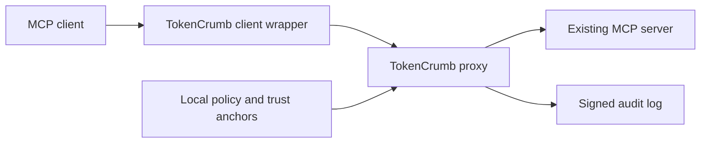

# TokenCrumb - MCP Proxy

A Rust authorization proxy for MCP servers, using attenuable [Biscuit](https://www.biscuitsec.org/) capabilities.

TokenCrumb checks each tool call against a signed capability and a local policy before forwarding it to an existing MCP server. Agents can narrow a capability offline without gaining new permissions. Signed call attestations bind the agent, tool, arguments and token; a signed audit chain records authorization decisions.



## Features

- Tool and resource restrictions, expiry, audience binding and delegation limits.
- Offline attenuation of tools, resources, lifetime, upstream and call budget.
- Agent key binding, argument binding and persistent replay protection.
- Multiple upstreams, with a separate MCP endpoint for each.
- Persistent budgets, signed revocation lists and verifiable audit logs.
- HTTP and stdio upstreams; a stdio client wrapper for desktop MCP clients.
- A CLI for keys, capabilities, policy updates, issuer bootstrap and audit verification.

## Contents

- [Installation](#installation)
- [Quick start](#quick-start)
- [Configuration](#configuration)
- [CLI reference](#cli-reference)
- [Deployment](#deployment)
- [Architecture](#architecture)
- [Security model](#security-model)
- [Reporting vulnerabilities](#reporting-vulnerabilities)
- [Compatibility and test fixtures](#compatibility-and-test-fixtures)
- [Temporary Biscuit dependency](#temporary-biscuit-dependency)
- [Development and contributions](#development-and-contributions)
- [License](#license)

Release history is maintained in [CHANGELOG.md](CHANGELOG.md).

## Installation

Supports Linux and macOS with Rust 1.88 or newer. Windows is not supported: persistent storage uses Unix permissions and file locking. Run the following from the root of a full repository checkout:

```sh
cargo install --locked --path crates/tokencrumb-mcp-proxy
tokencrumb --help
```

The executable is `tokencrumb`; the Rust package is `tokencrumb-mcp-proxy`. Cargo's installation `bin` directory must be on `PATH` (normally `~/.cargo/bin`).

**Temporary custom dependency:** this checkout includes `biscuit-auth` **6.0.0-tokencrumb.1**, a minimally patched version of upstream 6.0.0 that allows unused macros and their unmaintained `proc-macro-error2` dependency to be disabled. We will return to the official crate as soon as a release fixes this issue and passes our compatibility and security checks. See [the patch, provenance and return-to-upstream plan](#temporary-biscuit-dependency). Install from the full checkout; crates.io publication is disabled while this local dependency is required.

## Quick start

Use an existing MCP server exposing `read_file` with an `arguments.path` field. The supplied policy permits paths under `/workspace/`; adapt it to the server's actual tools and filesystem.

The commands below are for a local demonstration on one machine. Use a new `state/` directory; `keygen` replaces existing output files. In deployment, keep the authority private key on the issuer, the agent private key on the client, and only the audit private key on the proxy.

From the repository root:

```sh
umask 077
mkdir -p state
tokencrumb keygen --type authority --out state/authority
tokencrumb keygen --type agent --out state/agent
tokencrumb keygen --type audit --out state/audit

tokencrumb forge --key state/authority.key \
  --tool read_file --operation read --agent-id reader \
  --agent-pubkey "$(cat state/agent.pub)" \
  --required-profile hardened_biscuit_anchored \
  --audience local-gateway --resource-prefix /workspace/ \
  --ttl 15m --budget 20 --out state/capability.b64

tokencrumb serve --upstream http://127.0.0.1:8080/mcp \
  --authority-pub state/authority.pub --policy policy.yaml \
  --audience local-gateway --audit-key state/audit.key \
  --audit state/audit.log --budget-state state/budget.json \
  --listen 127.0.0.1:9443
```

Leave `serve` running and configure the client below in another terminal or application. The upstream on port 8080 must already be running; TokenCrumb does not provide that filesystem server.

### Connect a client

A desktop client supporting stdio MCP servers can launch:

```json
{
  "mcpServers": {
    "workspace": {
      "command": "/absolute/path/to/tokencrumb",
      "args": [
        "client-wrap",
        "--proxy", "http://127.0.0.1:9443/mcp",
        "--token", "/absolute/path/to/state/capability.b64",
        "--agent-key", "/absolute/path/to/state/agent.key"
      ]
    }
  }
}
```

Replace every `/absolute/path/` placeholder with an actual path.

The wrapper uses newline-delimited JSON-RPC on stdin/stdout. Diagnostics go to stderr. It signs each `tools/call` and reloads a file-backed capability when that file changes. Give each configured upstream its own client entry.

A call to `read_file` with `{"path":"/workspace/notes.txt"}` can pass the sample policy. `/private/notes.txt` must be denied before reaching the upstream. The upstream still applies its own authorization and filesystem controls.

### Narrow a capability

```sh
tokencrumb attenuate --token state/capability.b64 \
  --authority-pub state/authority.pub \
  --resource /workspace/reports/ --budget 5 --ttl 5m \
  --tool read_file --out state/restricted.b64

tokencrumb inspect state/restricted.b64
```

Use `restricted.b64` in the wrapper to apply the tighter scope. Each appended block adds constraints. It cannot extend the original lifetime, restore a removed tool or reset the root capability's spent budget. Attenuate the latest token when extending an existing delegation chain.

`inspect` decodes a token for inspection; it is not a trust decision. The proxy verifies the signature against configured authority keys.

### Verify the audit

```sh
tokencrumb audit-verify --log state/audit.log --pub state/audit.pub
```

To retain an independent checkpoint:

```sh
tokencrumb audit-head --log state/audit.log --key state/audit.key \
  --out state/audit-head.json
```

Store checkpoints on a separate system the proxy cannot rewrite. An intact local chain alone does not prove completeness or protect against its own signing key holder.

## Configuration

The proxy loads a YAML policy and rejects unknown fields, duplicate mapping keys and inconsistent tool definitions. Start from [policy.yaml](policy.yaml); do not copy a policy without matching it to your upstream's actual behavior.

### Profiles and enforcement

| Setting | Behavior |
| --- | --- |
| `mode: enforce` | Refuse calls that fail authorization. |
| `mode: warn-only` | Record authorization failures while permitting otherwise dispatchable calls; unsuitable as a security boundary. |
| `min_profile: native` | Permit bearer capabilities where tool requirements allow them. |
| `min_profile: registry_backed` | Require agent call signatures with keys resolved through a trusted signed registry. |
| `min_profile: hardened_biscuit_anchored` | Require agent call signatures with the key anchored in the capability's authority block. |

The supplied policy uses `enforce` and `hardened_biscuit_anchored`. A token's own required profile cannot be downgraded by the caller. CLI `--mode` and `--min-profile` override the file and are reflected in the effective policy digest.

### Tools and facts

Each tool defines `name`, `operation`, optional `resource.from`, `allow` constraints, and `require` proofs. `resource.from: arguments.path` projects a call argument into the resource checked by Datalog. Resource prefixes are canonicalized with path-boundary checks. Mapping a field does not establish its business meaning or resolve the upstream's symlinks.

The proxy injects trusted call context such as `tool`, `operation`, `resource`, `upstream`, `arg`, `budget` and verified proof facts. Capabilities cannot declare those trusted context facts themselves. To bind a scalar argument to signed authority facts:

```yaml
tools:
  - name: get_record
    operation: read
    args:
      - from: arguments.record_id
        as: record_id
```

With the keys from the quick start, issue the corresponding capability:

```sh
tokencrumb forge --key state/authority.key \
  --tool get_record --operation read --agent-id reader \
  --agent-pubkey "$(cat state/agent.pub)" \
  --required-profile hardened_biscuit_anchored --audience local-gateway \
  --fact 'assigned_record("R-1")' --scope-arg record_id=assigned_record \
  --ttl 15m --budget 20 --out state/record-capability.b64
```

Every value of each mapped list argument must satisfy authorization; a call cannot mix an allowed identifier with a forbidden one.

### Budgets and expiry

`allow.budget` bounds each tool. `budget_total` optionally adds a policy-wide ceiling per root capability. Signed `budget_cap` facts narrow the capability budget; the tightest applicable limit wins. Attenuation descendants share the root budget identity.

`max_ttl` bounds the remaining signed lifetime at verification time. `clock_skew_seconds` and `serve --freshness` control call-attestation timestamp acceptance. Expiry, audience and governed identity facts are checked independently of arbitrary token Datalog.

The `limits` section bounds token size, Datalog facts, iterations and execution time. Tune these against real policies and retain adversarial tests; disabling limits is not supported.

### Multiple upstreams

```yaml
mode: enforce
min_profile: hardened_biscuit_anchored
upstreams:
  catalog: https://catalog.example.com/mcp
  inventory: https://inventory.example.com/mcp
tools:
  - name: search_records
    upstream: catalog
    operation: read
  - name: get_stock
    upstream: inventory
    operation: read
```

These are served at `/mcp/catalog` and `/mcp/inventory`. Do not pass `--upstream` when the policy declares `upstreams`. With multiple upstreams each tool needs an explicit target. `upstream_tool` can map a public tool name to a different upstream name; authorization and call signatures use the public name.

An audience identifies the deployment; an upstream restriction identifies a route within it. They are distinct checks. Sessions remain scoped to their endpoint; budgets and audit state are shared.

### Upstream credentials

Use environment references, not secret values on the command line:

```sh
tokencrumb serve --help
# Add to your serve invocation:
# --upstream-header catalog:X-API-Key=CATALOG_API_KEY
```

For identity-bound forwarding, `--upstream-user-credentials` takes the **path to a JSON file**, for example `state/upstream-users.json`. The file contains an array such as:

```json
[{"upstream":"catalog","issuer":"https://issuer.example.com","subject":"reader","header":"Authorization","env":"CATALOG_READER_AUTH"}]
```

Add `--upstream-user-credentials state/upstream-users.json` to `serve` and provision the referenced environment variable before starting the process. The environment variable holds the complete header value. The proxy selects it only for the verified issuer and subject. It does not turn delegation into upstream entitlement or automatically exchange upstream credentials.

### Reload and revocation

Enable `--reload-policy` and publish validated updates atomically:

```sh
tokencrumb policy-install next-policy.yaml policy.yaml
```

The source file must exist. Invalid updates do not replace the active policy. Upstream topology stays fixed until restart. Configure `revocation: /path/to/revoked.list` for a signed revocation list; `--revocation-pub` selects a separate signer when required. Use the [CLI](#cli-reference) to create and update the list.

## CLI reference

Run `tokencrumb --help` or `tokencrumb <command> --help` for all flags. Usage errors exit with status 2; rejected operations exit with status 1. Commands producing tokens send status messages to stderr so stdout can be redirected safely.

| Command | Purpose |
| --- | --- |
| `keygen` | Generate authority, agent or audit Ed25519 keys. |
| `forge` | Sign an authority capability for a tool, with audience, expiry and optional scope. |
| `attenuate` | Append restrictions without the authority private key. |
| `inspect` | Decode blocks and metadata without establishing trust. |
| `serve` | Run the authorization proxy. |
| `client-wrap` | Adapt a stdio MCP client to the proxy and sign tool calls. |
| `bootstrap` | Validate an issuer URL or verify a returned token against a provisioned trust anchor. |
| `dpop-proof` | Produce an agent-signed proof for an issuer HTTP request. |
| `policy-install` | Validate and atomically replace a policy file. |
| `revoke` | Add a token or identifier to a signed revocation list. |
| `revocation-migrate` | Verify and convert a legacy signed revocation list into a new file. |
| `registry-serve` | Serve signed agent key records for the registry-backed profile. |
| `registry-add` | Register an agent key over HTTP or directly in a store. |
| `audit-verify` | Check audit hashes, signatures and chain continuity. |
| `audit-head` | Produce a signed checkpoint for an independent witness. |

### Issuer integration

Provision the authority public key through a trusted channel first. Save the issuer response separately as `state/issuer-response.json`; these commands do not perform the issuer exchange. The response is not a source of trust anchors.

```sh
tokencrumb bootstrap --url https://issuer.example.com/capabilities
tokencrumb bootstrap --response state/issuer-response.json \
  --authority-pub state/authority.pub --out state/capability.b64
tokencrumb dpop-proof --agent-key state/agent.key \
  --url https://issuer.example.com/capabilities --method POST
```

`bootstrap --url` validates transport safety; it does not authenticate to the issuer or request a capability. `dpop-proof` creates a proof for the requested method and URL. The issuer must verify proof possession and apply its own issuance policy. `bootstrap --response` accepts either a `biscuit` field or an OIDC `access_token` carrying a `biscuit` claim. It verifies the embedded Biscuit against the supplied authority key; it does not verify the enclosing JWT signature or establish OIDC authentication. The proxy still performs authorization when a tool is called.

### Revoke a capability

```sh
tokencrumb revoke --key state/authority.key \
  --from-token state/capability.b64 --out state/revoked.list
```

`--from-token` revokes the root capability family, including attenuated descendants. Set the policy's `revocation` path to this file. Revocation must be distributed to each verifier. Signed snapshots expire; refresh and distribute them before `next_update`. Repeating `revoke` with an already revoked token republishes the list with a new sequence and freshness window. Multiple accepted authority keys do not imply multiple required signers.

### Registry-backed profile

```sh
tokencrumb keygen --out state/registry --type authority
tokencrumb registry-add --agent-id reader --pubkey "$(cat state/agent.pub)" \
  --store state/agents.json
tokencrumb registry-serve --signing-key state/registry.key \
  --store state/agents.json --write-token file:/absolute/path/to/registry-write-token \
  --listen 127.0.0.1:8081
```

Provision the write-token file separately. Configure the proxy with `--registry`, `--registry-pub` and an appropriate policy profile. Use TLS for remote registry access. The default key-anchored profile needs no registry.

### Keys and persistence

`keygen --passphrase <value>` encrypts a private key with scrypt and AES-GCM. This option takes a command-line value, not an interactive prompt; shell history and process listings can expose it. `serve` and `registry-serve` have no passphrase option and require signing-key files they can load without one. Generated plaintext keys require restricted filesystem permissions and an appropriate key-management process.

The proxy requires `--audit-key`; `--ephemeral-audit-key` is an explicit alternative with no persistent signing identity. Budget state defaults to `<audit-path>.budget.json`; specify `--budget-state` to choose another path. The nonce database is `<budget-state>.nonces.db`.

## Deployment

### Trust and network boundaries

Keep the authority private key on the issuer and the agent private key on the client. Provision only authority public keys, the proxy's audit signing key and necessary upstream credentials to the proxy.

Clients must reach protected tools through the proxy. Enforce that with upstream network isolation or independent upstream authentication. Otherwise a caller can bypass the proxy completely.

The CLI refuses non-loopback cleartext listeners unless `--insecure-http` is explicit. Prefer native TLS with `--tls-cert` and `--tls-key`. Certificates must be renewed externally and the process restarted; ACME and certificate hot reload are not implemented. If a reverse proxy terminates TLS, keep the cleartext hop in a trusted isolated network.

### Container

```sh
docker build -f deploy/Dockerfile -t tokencrumb-mcp-proxy:local .
docker run --rm tokencrumb-mcp-proxy:local --help
```

The image runs as UID 10001 and contains the CLI and CA certificates. Its build context uses an allowlist. The build context excludes local state, generated keys, capability files and logs.

The [Compose configuration](docker-compose.yml) requires:

- `state/config/authority.pub`: the trusted issuer key.
- `state/config/audit.key`: the proxy audit signing key, readable by UID 10001.
- `state/config/policy.yaml`: a policy matching your upstream.
- `state/config/tls.crt` and `state/config/tls.key`: your server certificate and private key.
- `UPSTREAM_URL`: an MCP endpoint reachable from the container.

```sh
UPSTREAM_URL=https://upstream.example.com/mcp docker compose config
UPSTREAM_URL=https://upstream.example.com/mcp docker compose up --build -d
```

The URL above is a placeholder. Replace it before starting. Set `TOKENCRUMB_CONFIG_DIR` for another configuration directory and `TOKENCRUMB_AUDIENCE` for the deployment audience. The listener is published only on host loopback; configure ingress deliberately for remote clients. The configuration mount is read-only and persistent state uses a named volume. Provision permissions before startup; do not make private keys world-readable.

### Persistent state and recovery

Retain the budget file, its lock, the nonce database, audit log and audit lock on durable local storage. The default nonce path is `<budget-state>.nonces.db`. Restoring an old budget or nonce snapshot can re-enable operations or replay: treat state rollback as a security event, not a routine deployment shortcut.

When revocation is enabled, also retain the signed list, its `<revocation-path>.accepted` snapshot and associated lock files. The proxy needs write access beside the list to persist accepted state. In containers, use durable writable storage for that path rather than the read-only `/config` mount. Rolling back both the list and accepted state defeats local rollback protection.

Use one replica by default. Local workers require shared persistent paths and compatible locking; multiple hosts and distributed state coordination are not provided. Never deploy independent replicas with separate counters and claim a global budget.

Retain signed audit checkpoints independently. Back up keys and state with access controls appropriate to their contents. Keep capability contents and upstream secrets out of ordinary diagnostics.

### Updates

Use a tested commit or an immutable digest of an image you built. Validate configuration before replacing it with `policy-install`. Test authority and audit key rotation using the explicit previous-key options before removing an old trust anchor. Restart for changes to upstream topology or certificates.

CI builds and tests images without publishing them. Repository or package visibility changes are separate administrative actions.

## Architecture

The Rust package contains the verifier, cryptographic and persistence primitives, MCP proxy, registry, and CLI. They share a library; ownership of private keys is a deployment boundary, not a claim that every command runs in one process.

### Control and data paths

The issuer signs the authority block of a Biscuit capability. Holders can append checks offline to reduce its scope. The agent wrapper signs each tool call. The proxy verifies the capability and call, applies its policy, records a decision and forwards an authorized request. Upstream authorization remains in force.

The authority public key is the trust anchor. An issuer name is signed metadata, not a replacement for a trusted key. Governed identity fields are accepted only from the authority block. Appended blocks cannot substitute an agent key, audience or issuer identity.

### Verification

The implementation performs bounded token parsing and signature verification, validates governed metadata and expiry, checks the required profile, validates call attestations where required, canonicalizes resources and arguments, evaluates Datalog checks and policy, and atomically charges the applicable budget. Errors fail closed in enforcement mode.

Attestations bind the agent identity, tool name, canonical argument hash and capability hash, with a timestamp and nonce. Signature verification alone is insufficient: freshness, token binding, expected identity and nonce state are checked as part of the authorization decision.

The policy supplies trusted facts for the current call. A capability may constrain those facts with checks; it may not manufacture verified proof facts. The effective rights are the intersection of the authority's grant, appended restrictions, runtime policy and upstream authorization.

### MCP transport

The supported MCP revision is `2025-06-18`; other configured revisions are rejected. Each upstream has its own endpoint and sessions. Tool lists are filtered through local policy mappings; callers still need authorization for each tool call. JSON-RPC batches and unsupported methods are refused. Server-initiated interaction and a long-lived server event channel are outside the supported surface.

HTTP upstreams use transport clients; stdio upstreams run as child processes. For a stdio upstream, pass a quoted executable and arguments as `--upstream` instead of an HTTP URL. The command is split into arguments without a shell; shell pipelines and expansion are not supported. Child process commands are operator configuration, not client-supplied actions. The client wrapper translates stdio JSON-RPC into calls to the proxy.

### State and audit

Budget counters are keyed by the root capability and by tool. Attenuation does not create a fresh spending identity. Nonces persist in SQLite. Signed revocation documents are validated before use. File publication and locking protect local state transitions; no distributed transaction manager is included.

Audit entries carry sequence, previous hash, policy digest, decision context and a signature. Client-facing denials are generic and expose a correlation identifier; detailed reasons belong in the audit. Verify the chain with separately trusted public keys and retain external checkpoints to detect history rewrites by the audit signer.

## Security model

### Protected boundary

In enforcement mode, the proxy prevents forwarding a tool call unless its trusted authority capability, profile requirements, call attestation where required, policy checks and budget permit it. This assumes clients cannot bypass the proxy and the host, configured trust anchors, clock and persistent state remain trustworthy.

The default policy requires `hardened_biscuit_anchored`. A stolen capability alone does not provide the agent private key needed to sign a new call. A captured signed call is also subject to nonce and timestamp checks. The `native` profile intentionally retains bearer semantics; never attribute proof-of-possession guarantees to that profile.

### Controls and regression coverage

| Threat | Control | Test suite |
| --- | --- | --- |
| Stolen token with a substituted agent key | Authority-only key binding and profile enforcement | `adversarial`, `security_contract` |
| Replayed or modified call | Signature, nonce, timestamp, argument and token binding | `verifier`, `security_lifecycle` |
| Token for another deployment or route | Audience and upstream checks | `audience_upstream`, `multi_upstream` |
| Broader delegation | Append-only restrictions and tightest signed bounds | `delegation_depth`, `tool_attenuation` |
| Budget reset after attenuation or restart | Root-based counters and durable state | `budget_two_level`, `budget_persist`, `one_shot` |
| Policy or parser confusion | Strict JSON/YAML, typed metadata and bounded Datalog | `security_configuration`, `security_contract`, `datalog_limits` |
| Hidden protocol route | Explicit MCP method handling | `proxy_router`, `security_http_audit` |
| Audit tampering without the key | Signed hash chain and trusted key verification | `audit_chain` |

These tests establish specific local behaviors, not a certification of any deployment.

### Limits

- An operator controlling the host can change policy, keys, code, clock or persistent state. Cryptography does not make that operator untrusted by default.
- An issuer holding a trusted authority private key can issue new capabilities. Accepting several roots means any accepted root can authorize; it is not a quorum.
- An agent with valid keys can abuse any operation actually granted to it. The proxy does not make model output truthful or prevent prompt injection from selecting an allowed tool.
- Resource mappings depend on upstream semantics. Canonicalizing a path does not resolve symlinks or prove what a remote tool will read.
- Budgets count authorized calls, not bytes, rows, monetary cost or exactly-once upstream effects. A failure after authorization can consume budget without a successful upstream result.
- Local state persistence is not a cross-host distributed consistency guarantee. Rollback or independent replicas can violate intended global limits.
- Audit integrity does not prove completeness. The audit signer can rewrite and re-sign a local chain unless an independent witness retains checkpoints.
- Revocation is effective after trusted updates reach the verifier. It is not an instantaneous global operation.
- MCP resources, prompts and server-initiated interaction are unsupported. `tools/list` is catalog filtering, not an authorization grant.
- Observation mode is not an enforcement boundary. TLS, host protection, key lifecycle and upstream access controls remain deployment responsibilities.

Report vulnerabilities through the process [below](#reporting-vulnerabilities).

## Reporting vulnerabilities

Report suspected vulnerabilities privately to [als0m3@proton.me](mailto:als0m3@proton.me). If the repository offers **Security → Report a vulnerability**, you may also use that channel. Do not include exploit details, credentials or operational tokens in a public issue.

Include the affected commit, configuration, expected and actual behavior, and a minimal reproducer with synthetic keys and data. Security fixes target the current development branch; no long-term support or response-time commitment is offered for older revisions.

## Compatibility and test fixtures

The product is **TokenCrumb - MCP Proxy**. The executable is `tokencrumb`, the Cargo package is `tokencrumb-mcp-proxy`, and the Rust import is `tokencrumb_mcp_proxy`.

Existing command-line integrations must update the executable path. Reference fixtures test compatibility of capability, policy and signed storage formats. This does not promise compatibility with every MCP client or every configuration from an older release.

### Signed identifiers

The attestation domain `biscuitmcp/tools-call` and registry domain `biscuitmcp/agent-registry` remain unchanged. These are cryptographic protocol identifiers, not presentation labels. Changing them silently would invalidate signatures and break existing issuers or clients. The synthetic interoperability audience `biscuitmcp://interop` is likewise retained inside signed test tokens.

Do not perform a global replacement of those values. A future protocol migration must use explicit versioning, documented trust rules and cross-implementation tests.

### Reference fixtures

`crates/tokencrumb-mcp-proxy/tests/golden/` contains fixed outputs captured from an independent Python reference implementation. Inputs use synthetic keys and test identifiers. The Rust tests verify these outputs rather than regenerating their own expected answers.

`crates/tokencrumb-mcp-proxy/tests/fixtures/interop/interop.json` exercises capabilities, encrypted keys, revocation and audit data written by the reference CLI. `crates/tokencrumb-mcp-proxy/tests/fixtures/java_mandate.json` exercises independent issuer interoperability. Private keys, encrypted keys, tokens and signatures embedded in the fixture and golden files are public test data and must never be deployed. Do not regenerate expected cryptographic outputs from the implementation under test to make a failure disappear.

Unicode, intentionally malformed tokens and legacy format samples are deliberate test inputs. They are not user-facing language or live credentials. The runtime and normal test suite require no Python package dependencies; the smoke and documentation tools use only Python's standard library.

## Temporary Biscuit dependency

TokenCrumb currently uses **`biscuit-auth` 6.0.0-tokencrumb.1**, a custom build of the official 6.0.0 crate included in [vendor/biscuit-auth](vendor/biscuit-auth/README.md). This is a temporary workaround, not an official Biscuit release or a separately maintained implementation.

### Why it exists

The official crate enables `datalog-macro` by default. That feature pulls in `biscuit-quote`, which depends on the unmaintained `proc-macro-error2` ([RUSTSEC-2026-0173](https://rustsec.org/advisories/RUSTSEC-2026-0173.html)). TokenCrumb builds its Datalog rules at runtime and does not need these compile-time macros.

Disabling the feature in upstream 6.0.0 fails to compile: five modules import `ToAnyParam` even though the trait is feature-gated. Our patch applies the same gate to those five imports and gates one related `PublicKey` import to avoid an unused-import warning. Cryptographic operations, signatures, token formats, Datalog evaluation and authorization logic are unchanged.

TokenCrumb uses `default-features = false` with `regex-full` and `pem` enabled, preserving the other previous default features. Neither `biscuit-quote` nor `proc-macro-error2` is present in the project lockfile.

### Provenance and validation

The source comes from the published `biscuit-auth` 6.0.0 crate, corresponding to upstream commit `0f0b4e0e6fe07220c1ba6b51bff21d450d94a975`. The [provenance manifest](vendor/biscuit-auth/UPSTREAM.json) records the archive checksum and original/custom SHA-256 hashes for every retained file. The [patch](vendor/biscuit-auth/tokencrumb.patch) records every change to retained upstream files, including the build-only manifest adjustments. The original Apache-2.0 license and source attribution are preserved.

CI runs `python3 tools/check_vendor.py` to verify the vendored files, the selected custom dependency and the absence of the two macro packages from the lockfile. Existing security, reference-fixture, issuer interoperability and HTTP/HTTPS checks exercise TokenCrumb against this custom build.

`cargo audit` skips local dependencies. Therefore `python3 tools/audit_dependencies.py` audits both the real lockfile and a temporary copy that identifies Biscuit by its original official version and registry checksum. This ensures advisories against upstream 6.0.0 remain visible while we use the local patch; the build still uses the custom source. No advisory is suppressed.

The snapshot contains upstream build inputs, not its standalone examples, test harness or benchmarks. Its custom version and `publish = false` make its status explicit. Build and install from the full repository checkout, or use the Dockerfile; registry publication of TokenCrumb is disabled while this local dependency is required. A source archive must contain `vendor/` alongside the workspace manifests and lockfile.

### Return to the official release

**Replace this custom dependency as soon as an official release fixes the feature-gating issue and passes validation.** A new version number alone is not sufficient: it must build with `datalog-macro` disabled and retain protocol compatibility.

When that release is available:

1. Replace the local `biscuit-auth` entry in the root manifest with an exact official registry version, keeping `default-features = false` and the required `regex-full` and `pem` features. Update `Cargo.lock` and confirm the macro packages remain absent.
2. Run the complete [development checks](#development-and-contributions), including independent compatibility fixtures, issuer interoperability, HTTP/HTTPS smoke checks, supported Rust versions and dependency auditing. Review upstream behavior changes before accepting them.
3. Remove `vendor/biscuit-auth`, its workspace exclusion, the vendor verification script/CI step, and vendor-specific Docker copy/ignore entries. Replace the custom dependency audit script with a direct `cargo audit` check. Remove the temporary publication restriction once registry packaging succeeds again.
4. Update this guide and the changelog to record the official version and removal of the workaround.

Maintainers should check [upstream releases](https://github.com/eclipse-biscuit/biscuit-rust/releases) during dependency updates. The switch requires a reviewed dependency update; builds do not automatically follow upstream releases.

## Development and contributions

Use English for code, documentation, issues, pull requests and commit messages. Before changing authorization or storage, read the [architecture](#architecture), [security model](#security-model) and [signed identifiers](#signed-identifiers). Explain behavior changes and add regression tests that would fail without them.

Keep contributions focused and include relevant check results in pull requests. Never commit operational credentials, generated keys, tokens, logs or private infrastructure details. Fixed synthetic cryptographic fixtures belong only in the directories described under [compatibility](#compatibility-and-test-fixtures).

CI covers Linux and macOS. Use Rust 1.88 or newer and Python 3.11 or newer for repository checks. Build dependencies are recorded in `Cargo.lock`. Install `cargo-audit` (CI uses `cargo install cargo-audit --locked --version 0.22.2`), Gitleaks and Docker before running the complete checklist below. Docker must be running; the TLS smoke check requires OpenSSL on `PATH`.

```sh
cargo fmt --check
cargo clippy --workspace --all-targets --locked -- -D warnings
cargo test --workspace --locked
RUSTDOCFLAGS="-D warnings" cargo doc --workspace --no-deps --locked
cargo build --release --locked --bin tokencrumb
python3 tools/check_vendor.py
python3 tools/audit_dependencies.py
python3 tools/check_docs.py
python3 tools/smoke.py --binary target/release/tokencrumb
python3 tools/smoke.py --binary target/release/tokencrumb --tls
cargo run --locked -p tokencrumb-interop -- crates/tokencrumb-mcp-proxy/tests/fixtures/java_mandate.json
docker build -f deploy/Dockerfile -t tokencrumb-mcp-proxy:local .
docker run --rm tokencrumb-mcp-proxy:local --help
docker run --rm tokencrumb-mcp-proxy:local --version
gitleaks dir --redact
gitleaks git --log-opts="--all" --redact
```

The library tests cover parsing, signatures, attenuation, revocation, replay protection, budgets and canonicalization. Integration tests cover CLI behavior, actual HTTP transports, state recovery and issuer interoperability. Fixed independent reference fixtures provide compatibility checks; do not regenerate expected cryptographic output from the implementation under test to make a failure disappear.

Use `cargo fmt --check` to check workspace members. Avoid `--all` while the custom Biscuit snapshot is present: it also formats local path dependencies and would rewrite preserved upstream source.

GitHub Actions are pinned to full commit SHAs in the CI workflow. Review upstream changes before updating a pin and keep its version comment accurate. Toolchain selectors such as Rust `stable` remain intentional moving targets for compatibility testing.

### Secret scanning

The checklist scans both current files and reachable Git history.

The repository configuration narrowly excludes reviewed public-key, nonce-digest and synthetic attestation fields in two reference fixture files from the generic API-key rule. These exceptions do not exempt other secret rules. A dedicated rule also detects the project’s plaintext Ed25519 key format, with exceptions for `tests/golden/keys.json`, `tests/golden/encrypted_key.json`, `tests/fixtures/interop/interop.json` and `tests/fixtures/java_mandate.json` under `crates/tokencrumb-mcp-proxy/` and the exact upstream test value described below. Test private keys are intentionally synthetic; operational keys belong outside Git.

The vendored Biscuit source retains upstream inline tests. Two additional exceptions match only the exact published test public key in `src/bwk.rs` and the exact synthetic private key in `src/crypto/mod.rs`, restricted to those vendor paths. Other values and files remain scanned.

### Dependency maintenance

Install `cargo-audit` and run `python3 tools/audit_dependencies.py` to check dependencies against RustSec. It runs `cargo audit` on the build lockfile, then audits a temporary copy that identifies the local Biscuit package by its official 6.0.0 version and registry checksum. This additional pass is required because `cargo audit` skips local dependencies. The real build lockfile is not modified. CI fails on known vulnerabilities and reports maintenance advisories. No advisory is suppressed.

Read the [patch scope, provenance and removal procedure](#temporary-biscuit-dependency) before updating the vendored dependency. `python3 tools/check_vendor.py` verifies the reviewed source and prevents reintroducing the macro packages into the lockfile.

### Packaging

Build and install from the full checkout with `cargo install --locked --path crates/tokencrumb-mcp-proxy`, or build the provided container. Source archives must include the `vendor/` directory.

Registry publication is temporarily disabled with `publish = false`. `cargo package` cannot produce a usable standalone registry package while the custom dependency exists only in this checkout; substituting the unpatched upstream crate would break the build. Restore registry packaging only after [returning to an official Biscuit release](#return-to-the-official-release). A successful local build is not permission to publish a package or change repository visibility.

## License

[Apache-2.0](LICENSE). Copyright and attribution remain with their respective holders. The vendored Biscuit source retains its [upstream license](vendor/biscuit-auth/LICENSE) and [provenance notice](vendor/biscuit-auth/README.md).
